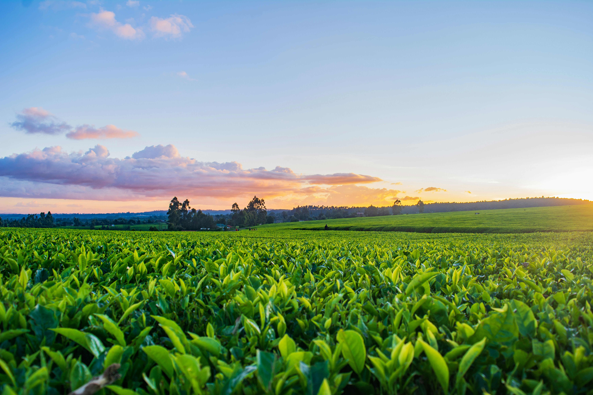

# 🌱 OptiCrop: Smart Agricultural Production Optimization Engine

<p align="center">
    
</p>

A Machine Learning-based web application that recommends the most suitable crop for cultivation based on soil nutrients and environmental conditions. The project is developed using **Python**, **Flask**, and **Scikit-learn** to support smart, data-driven, and sustainable farming.

---

## 🚀 Project Status

✅ Completed and Successfully Tested

---

## 📖 Overview

OptiCrop is an intelligent agricultural recommendation system that predicts the most suitable crop using machine learning techniques. By analyzing soil nutrients and environmental parameters, the system helps farmers make informed decisions to improve productivity, optimize resource utilization, and promote sustainable agricultural practices.

The application accepts the following agricultural inputs:

- Nitrogen (N)
- Phosphorus (P)
- Potassium (K)
- Temperature
- Humidity
- Soil pH
- Rainfall

Based on these parameters, the trained machine learning model predicts the most suitable crop for cultivation.

---

## ✨ Features

- 🌾 Machine Learning-based crop recommendation
- 🌱 User-friendly web interface
- 📊 Data preprocessing and feature analysis
- ⚡ Fast and accurate crop predictions
- 💻 Flask backend integration
- 📱 Responsive web design
- 🌍 Supports sustainable farming practices

---

## 🛠️ Technologies Used

### Frontend

- HTML5
- CSS3
- Bootstrap

### Backend

- Python
- Flask

### Machine Learning

- Random Forest Classifier
- Scikit-learn
- Pandas
- NumPy

### Tools

- Visual Studio Code
- Git
- GitHub

---

## 📂 Project Structure

```text
OptiCrop-Smart-Agricultural-Production-Optimization-Engine
│
├── .github/
│   └── workflows/
│       └── python-app.yml
├── assets/
│   └── images/
│       └── farm.jpg
├── dataset/
│   └── Crop_recommendation.csv
├── docs/
├── models/
│   └── model.pkl
├── notebooks/
├── src/
│   ├── app.py
│   └── train_model.py
├── static/
├── templates/
├── tests/
│   └── test_app.py
├── LICENSE
├── README.md
└── requirements.txt
```

---

## 🚀 Installation

### Clone the Repository

```bash
git clone https://github.com/Farisa-11/OptiCrop-Smart-Agricultural-Production-Optimization-Engine.git
```

### Open the Project

```bash
cd OptiCrop-Smart-Agricultural-Production-Optimization-Engine
```

### Create Virtual Environment

```bash
python -m venv venv
```

### Activate Virtual Environment

#### Windows

```bash
venv\Scripts\activate
```

#### Linux / macOS

```bash
source venv/bin/activate
```

### Install Dependencies

```bash
pip install -r requirements.txt
```

---

## ▶️ Run the Application

```bash
cd src
python app.py
```

After running the application, open your browser and visit:

```text
http://127.0.0.1:5000/
```

---

## 🤖 Machine Learning Workflow

```text
Agricultural Dataset
          │
          ▼
Data Preprocessing
          │
          ▼
Feature Selection
          │
          ▼
Train Random Forest Model
          │
          ▼
Save Trained Model (model.pkl)
          │
          ▼
Flask Web Application
          │
          ▼
User Enters Agricultural Parameters
          │
          ▼
Crop Prediction Generated
          │
          ▼
Recommended Crop Displayed
```

---

## 📸 Screenshots

### Home Page

> Add `home.png` inside the `docs` folder.

```markdown

```

### About Page

```markdown

```

### Find Your Crop Page

```markdown

```

### Prediction Result

```markdown

```

---

## 📈 Expected Output

### Example Input

| Parameter | Value |
|-----------|------:|
| Nitrogen | 90 |
| Phosphorus | 42 |
| Potassium | 43 |
| Temperature | 20.8 |
| Humidity | 82 |
| Soil pH | 6.5 |
| Rainfall | 202 |

### Example Output

```text
Recommended Crop:
Rice
```

---

## 🌟 Future Enhancements

- 🌦️ Weather API Integration
- 🌱 Fertilizer Recommendation System
- 🦠 Crop Disease Prediction
- 📡 IoT-based Smart Farming Sensors
- 🤖 Deep Learning Models
- ☁️ Cloud Deployment
- 📱 Mobile Application Development
- 📊 Agricultural Analytics Dashboard

---

## 🎯 Conclusion

The **OptiCrop: Smart Agricultural Production Optimization Engine** demonstrates how Machine Learning and Artificial Intelligence can be effectively applied to modern agriculture. By combining predictive analytics with soil and environmental data, the system provides accurate crop recommendations that improve productivity, optimize resource utilization, and support sustainable farming practices.

The project serves as a strong foundation for future developments in precision agriculture, smart farming technologies, and intelligent agricultural decision-support systems.

---

## 👩‍💻 Author

**Farisa Almas**

GitHub: **[Farisa-11](https://github.com/Farisa-11)**

---

## ⭐ Support

If you found this project useful, please consider giving it a ⭐ on GitHub.